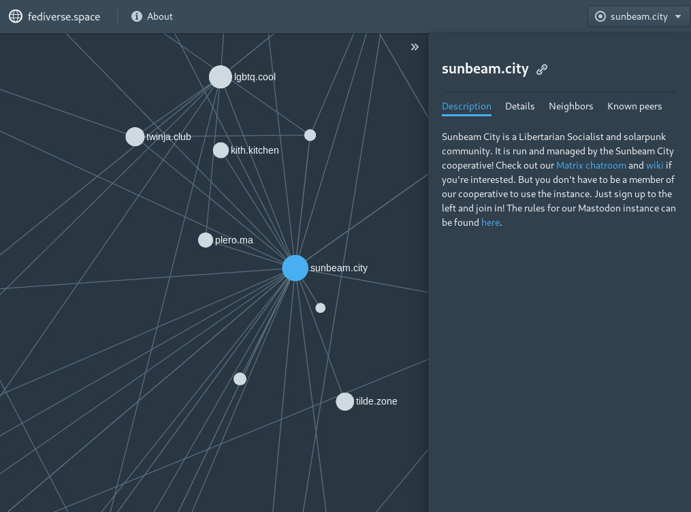

# fediverse.space 🌐

The map of the fediverse that you always wanted.

Read the latest updates on Mastodon: [@fediversespace](https://mastodon.social/@fediversespace)



- [fediverse.space 🌐](#fediversespace-%f0%9f%8c%90)
  - [Requirements](#requirements)
  - [Running it](#running-it)
    - [Backend](#backend)
    - [Frontend](#frontend)
  - [Commands](#commands)
    - [Backend](#backend-1)
    - [Frontend](#frontend-1)
  - [Privacy](#privacy)
  - [Deployment](#deployment)
  - [Acknowledgements](#acknowledgements)

## Requirements

Note: examples here use `podman`. In most cases you should be able to replace `podman` with `docker`, `podman-compose` with `docker-compose`, and so on.

Though containerized, backend development is easiest if you have the following installed.

- For the scraper + API:
  - Elixir
  - Postgres
- For laying out the graph:
  - Java
- For the frontend:
  - Node.js
  - Yarn

## Running it

### Backend

- `cp example.env .env` and modify environment variables as required
- `podman-compose build`
- `podman-compose -f compose.backend-services.yml -f compose.phoenix.yml`
- Create the elasticsearch index:
  - `iex -S mix app.start`
  - `Elasticsearch.Index.hot_swap(Backend.Elasticsearch.Cluster, :instances)`

### Frontend

- `cd frontend && yarn install`
- `yarn start`

## Commands

### Backend

`./gradlew shadowJar` compiles the graph layout program. `java -Xmx1g -jar build/libs/graphBuilder.jar` runs it.
If running in docker, this means you run

- `docker-compose build gephi`
- `docker-compose run gephi java -Xmx1g -jar build/libs/graphBuilder.jar` lays out the graph

### Frontend

- `yarn build` creates an optimized build for deployment

## Privacy

This project doesn't crawl personal instances: the goal is to understand communities, not individuals. The threshold for what makes an instance "personal" is defined in the [backend config](backend/config/config.exs) and the [graph builder SQL](gephi/src/main/java/space/fediverse/graph/GraphBuilder.java).

## Deployment

You don't have to follow these instructions, but it's one way to set up a continuous deployment pipeline. The following are for the backend; the frontend is just a static HTML/JS site that can be deployed anywhere.

1. Install [Dokku](http://dokku.viewdocs.io/dokku/) on your web server.
2. Install [dokku-postgres](https://github.com/dokku/dokku-postgres), [dokku-monorepo](https://github.com/notpushkin/dokku-monorepo), [dokku-elasticsearch](https://github.com/dokku/dokku-elasticsearch), and [dokku-letsencrypt](https://github.com/dokku/dokku-letsencrypt).
3. Create the apps

- `dokku apps:create phoenix`
- `dokku apps:create gephi`

4. Create the backing database

- `dokku postgres:create fediversedb`
- `dokku postgres:link fediversedb phoenix`
- `dokku postgres:link fediversedb gephi`

5. Set up ElasticSearch

- `dokku elasticsearch:create fediverse`
- `dokku elasticsearch:link fediverse phoenix`

6. Update the backend configuration. In particular, change the `user_agent` in [config.exs](/backend/config/config.exs) to something descriptive.
7. Push the apps, e.g. `git push dokku@<DOMAIN>:phoenix` (note that the first push cannot be from the CD pipeline).
8. Set up SSL for the Phoenix app

- `dokku letsencrypt phoenix`
- `dokku letsencrypt:cron-job --add`

9. Set up a cron job for the graph layout (use the `dokku` user). E.g.

```
SHELL=/bin/bash
0 2 * * * /usr/bin/dokku run gephi java -Xmx1g -jar build/libs/graphBuilder.jar
```

10. (Optional) Set up caching with something like [dokku-nginx-cache](https://github.com/Aluxian/dokku-nginx-cache)

Before the app starts running, make sure that the Elasticsearch index exists -- otherwise it'll create one called
`instances`, which should be the name of the alias. Then it won't be able to hot swap if you reindex in the future.

## Acknowledgements

[](https://nlnet.nl/project/fediverse_space/)

Many thanks to [NLnet](https://nlnet.nl/project/fediverse_space/) for their support and guidance of this project.
